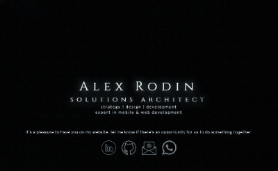

<div align="center">
    <h1>http://alexrodin.info</h1>
    <p align="center">
        <a href="http://alexrodin.info">
            
        </a>
    </p>
</div>

## Inspiração

A página é inspirada e baseada nos experimentos de [Nik Rowell](http://www.nikrowell.com/projects/ultraviolet) e [Pavel Dobryakov](http://github.com/PavelDoGreat/WebGL-Fluid-Simulation)


## Pre requisitos

- Node.js (npm)

## Servidor local

Inicia servidor local para desenvolvimento, com live reload, abre automaticamente o navegador no endereço `localhost:8080`.

```bash
npm install
npm start
```

## Construção da versão de publicação

Ao executar o comando abaixo, a versão final estará disponível na pasta `dist`, lá estará disponível também o conteúdo da pasta compactada no formato `tar.gz`, que uso para publicação no meu ambiente.


```bash
npm run-script build
```

## Publicação da versão de produção

A versão final, disponível na pasta `dist` pode ser executada com os comandos abaixo

```bash
cd dist
npm start
```

O script fará a instalação das dependencias de produção e inicializa o servidor na porta `3060`.


## Outras informações

- Problemas com nody-gyp no Windows? `npm install --global windows-build-tools`
- Problemas com nody-gyp no Ubuntu/Debian? `sudo apt-get install gcc g++ make` 
- [https://www.favicon-generator.org](https://www.favicon-generator.org) Usado para gerar o favicon
- [http://www.mp3smaller.com](http://www.mp3smaller.com) Usado para reduzir o tamanho do arquivo de áudio (Usei a opção: Small File Size (MP3 Bitrate 32-64Kbps VBR))
- [https://www.screentogif.com](https://www.screentogif.com) Usado para gravar o gif no topo dessa documentação.

> NOTA! No windows, execute o comando acima usando o PowerShell como Administrador


## Licença

Este código é distribuído sob os termos e condições da [licença MIT](LICENSE).
